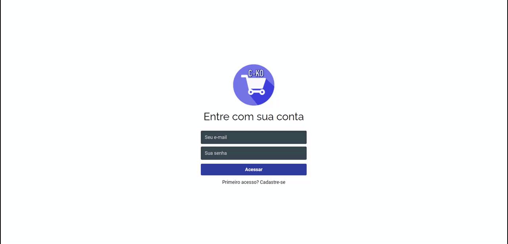
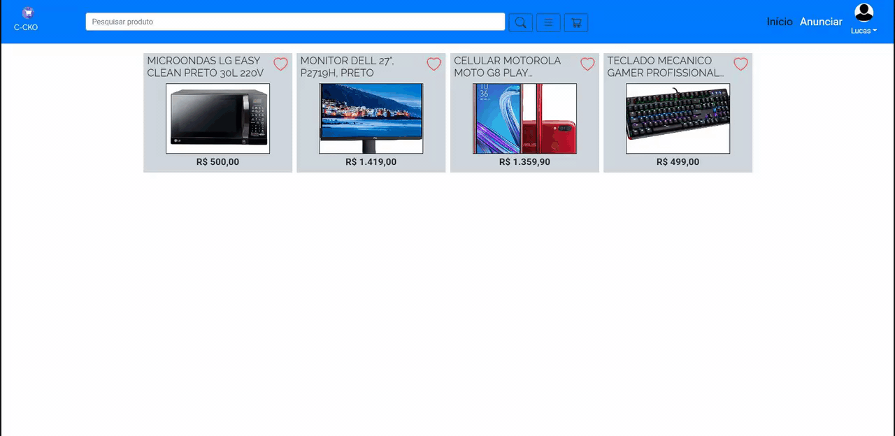
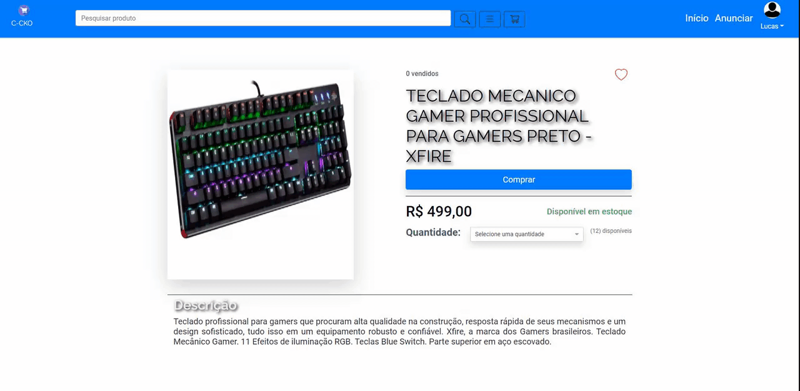
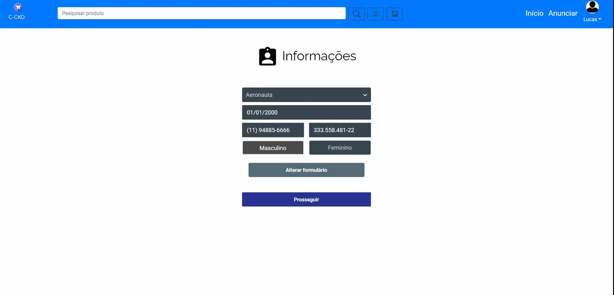
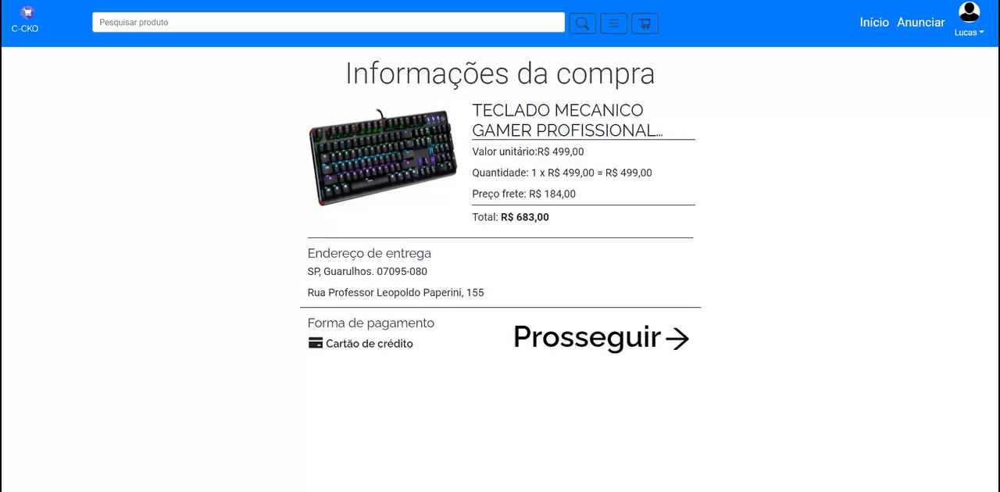
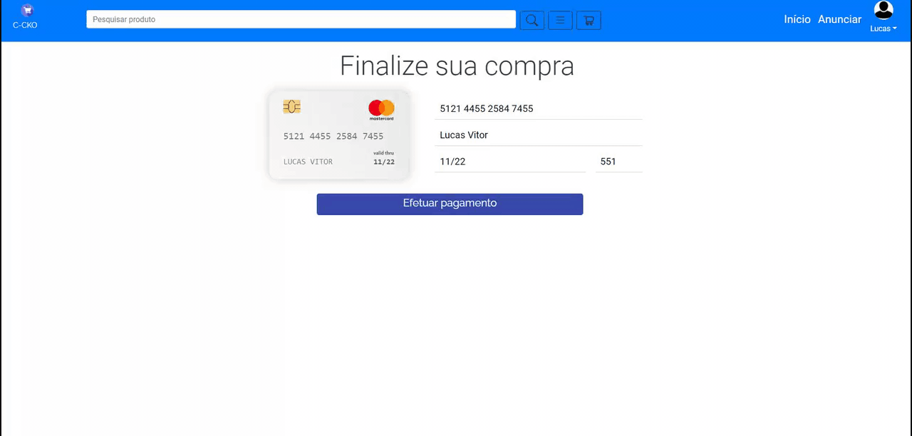
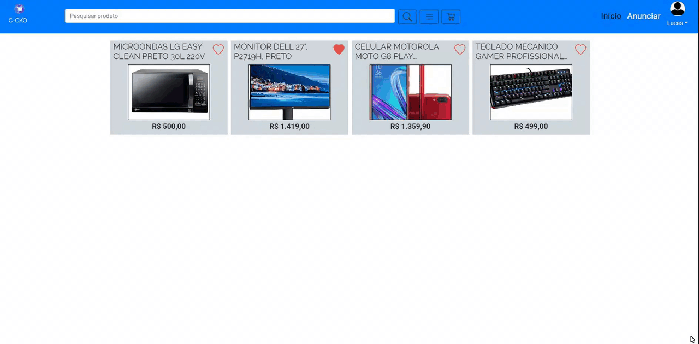
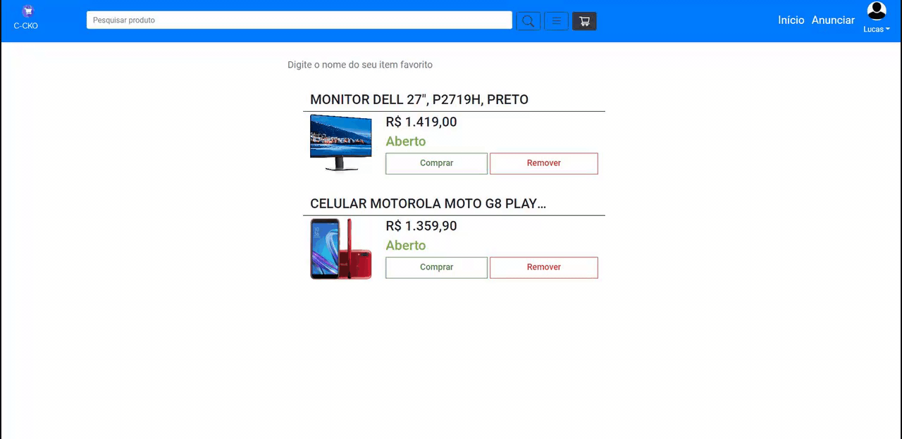

# C-CKO PROJECT 

This is a project developed by me using the most recent technologies.
It can be consired as a E-COMMERCE app, once there will be interactions between sellers and buyers.
They will be free to commercialize their products on the APP.
The main library used is **REACT JS** to work on mobile front-end.

Este é um projeto desenvolvido por mim utilizando as tecnologias mais recentes.
É um aplicativo E-COMMERCE, uma vez queh há interações entre vendedores e compradores.
Eles terão liberdade para comercializar seus produtos no APP.
A principal biblioteca usada é **REACT JS** para trabalhar no front-end móvel.

## SCREENSHOTS - CAPTURAS DE TELA

 
    
        
        
    
     
    
        
        
    
     
    
        
        
    
    
        
        
    

## BOOTSTRAP - RESPONSIBLE LAYOUT 

## What I used to develop it ?

Developing this app I used so many new libraries.
REACT-BOOTSTRAP was one of the most important libraries to HANDLE with styling, and also make the APPLICATION fits well in a lot of different sizes of screens.
STYLED-COMPONENT was used with BOOTSTRAP in most of the components.
About dealing with storage on front-end, I used: redux, redux-persist redux-saga and others to make the application store some short period informations or some of a bit longer by using the redux-persist witt LOCALFORAGE.
About dealing with ALERTS, I used react-toastify.
There are more tools that I used to build it, then I would like to you check it out the repository deeply.

Desenvolvendo este aplicativo, usei muitas novas bibliotecas.
REACT-BOOTSTRAP foi uma das bibliotecas mais importantes para manusear o style, e também fazer a página web se encaixar bem em muitos tamanhos de telas diferentes.
STYLED-COMPONENT foi usado com BOOTSTRAP na maioria dos componentes.
Sobre lidar com o armazenamento no front-end, usei: redux, redux-persist redux-saga e outros para fazer o aplicativo armazenar algumas informações de curto período ou um pouco mais longas usando o redux-persist com LOCALFORAGE.
Sobre como lidar com ALERTAS, usei react-toastify.
Existem mais ferramentas que usei para construí-lo, então eu gostaria que você verificasse profundamente o repositório.

The back-end part is on this repository:
[BACK-END C-KO E-COMMERCE](https://github.com/lucascicco/POSTGRES-BACK-END-CKO-PROJECT)

The MOBILE application is on this repository:
[MOBILE C-KO E-COMMERCE](https://github.com/lucascicco/C-KO-E-COMMERCE-REACT-NATIVE-APP)

Please, check it out. 
I am open minded about new suggestions.
Thank you for reading.

Created by LucasCicco.
