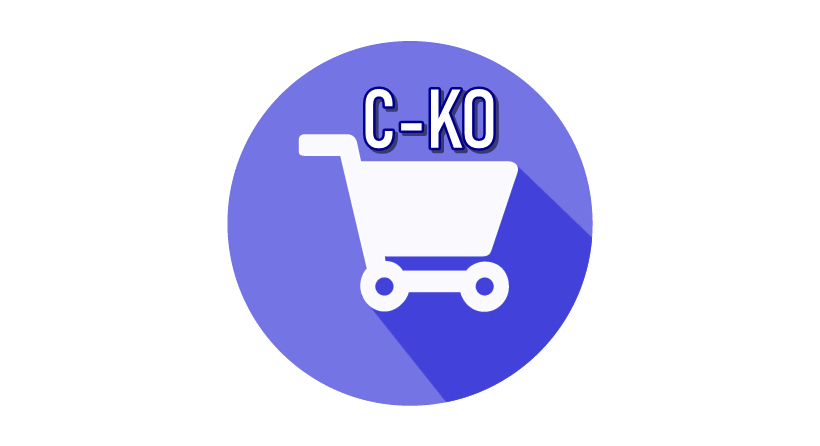
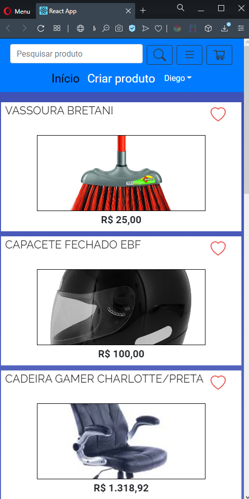

# C-CKO PROJECT 

This is a project developed by me using the most recent technologies.
It can be consired asa a E-COMMERCE app, once there will be interactions between sellers and buyers.
They will be free to commercialize their products on the APP.
The main library used is **REACT JS** to work on mobile front-end.

Here goes some of the screens of this project:

 
    
        
        
        
    
     
    
        
        
        
    
     
    
        
        
    

## BOOTSTRAP - RESPONSIBLE LAYOUT 

## What I used to develop it ?

Developing this app I used so many new libraries.
REACT-BOOTSTRAP was one of the most important libraries to HANDLE with styling, and also make the APPLICATION fits well in a lot of different sizes of screens.
STYLED-COMPONENT was used with BOOTSTRAP in most of the components.
About dealing with storage on front-end, I used: redux, redux-persist redux-saga and others to make the application store some short period informations or some of a bit longer by using the redux-persist witt LOCALFORAGE.
About dealing with ALERTS, I used react-toastify.
There are more tools that I used to build it, then I would like to you check it out the repository deeply.

The back-end part is on this repository:
[BACK-END C-KO E-COMMERCE](https://github.com/lucascicco/POSTGRES-BACK-END-CKO-PROJECT)

The MOBILE application is on this repository:
[MOBILE C-KO E-COMMERCE](https://github.com/lucascicco/C-KO-E-COMMERCE-REACT-NATIVE-APP)

Please, check it out. 
I am open minded about new suggestions.
Thank you for reading.

Created by Lucas Vitor.
